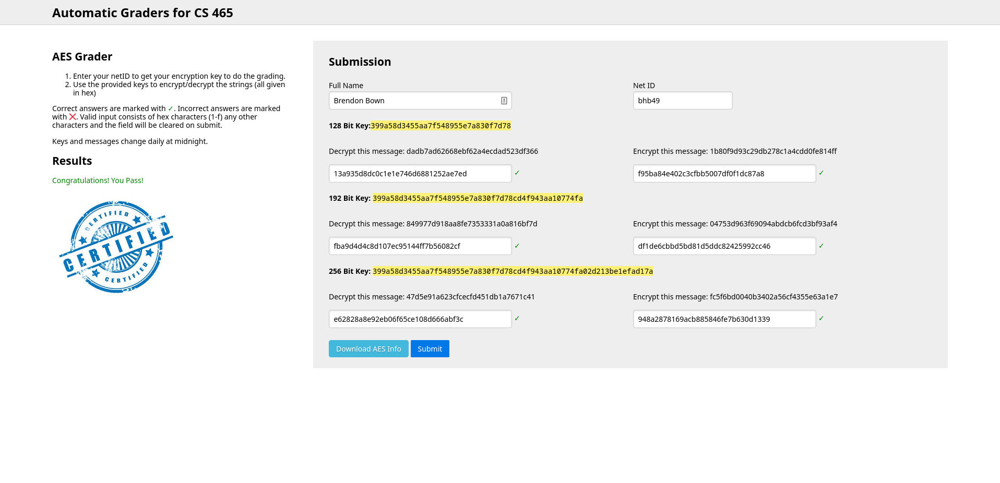

# AES Encryption Project

## Compile and Run

To compile and run the code, install Rust and cargo, then run `cargo run` in the root directory
of the project.

## Resources

I only used the following resources in order to implement the AES encryption algorithm:
- [FIPS Publication 197](https://cs465.byu.edu/static/pubs/fips-197.pdf)
- [Stick figure guide to AES](http://www.moserware.com/assets/stick-figure-guide-to-advanced/A%20Stick%20Figure%20Guide%20to%20the%20Advanced%20Encryption%20Standard%20%28AES%29.pdf)
- [Wikipedia entry on AES](http://en.wikipedia.org/wiki/Advanced_Encryption_Standard)
- [Animation of AES](https://www.youtube.com/watch?v=gP4PqVGudtg)
- [Lecture Slides on AES](https://cs465.byu.edu/static/lectures/w19/AES.pdf)

## Appendix C

This correctly encrypts and decrypts the examples provided in Appendix C. The steps in between don't
match the output of Appendix C, and I wasn't able to figure out why, but the final output is correct.

## Autograder

